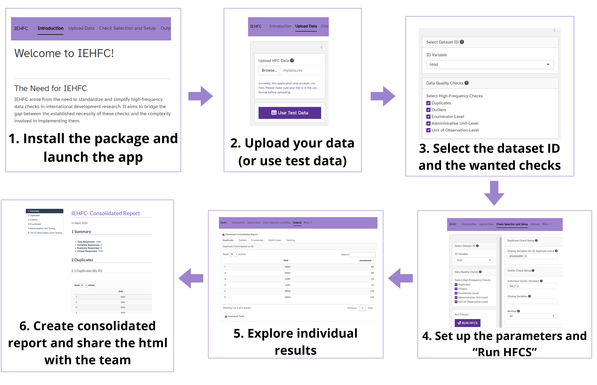

# 📦 IEHFC: High-Frequency Data Quality Checks

## 📄 Overview

The **IEHFC** package, developed by **DIME Analytics**, is a Shiny-based application designed to facilitate high-frequency data quality assessments in survey datasets. This tool provides an interactive dashboard to detect data inconsistencies, duplicate records, outliers, and other integrity issues, ensuring robust data quality control.

**Note**: This package is in Beta version; expect updates.

### ✨ Key Features

- **Data Upload & Inspection**: Users can upload datasets in `.csv` format and inspect data before running quality checks.
- **Automated Quality Checks**: The platform provides built-in functions for identifying duplicates, detecting outliers, and assessing enumerator performance.
- **Customizable Reports**: Users can generate and export reports summarizing data integrity checks.
- **Collaborative Analysis**: The tool allows for easy sharing of quality control outputs with research teams.

## 🛠️ Installation

To install the package directly from GitHub, open RStudio and run the following commands:

````r
# Install devtools if you don't have it yet
install.packages("devtools")

# Install the IEHFC package from GitHub
devtools::install_github("dime-worldbank/iehfc")
````

> **Note**: You may see a warning that says:  
> *"WARNING: Rtools is required to build R packages, but is not currently installed."*  
> You can safely ignore this message. Rtools is **not** required to install and use the app.

### ❗ Troubleshooting Installation Issues

If you run into errors related to the `promises` package (or another package), try restarting your R session and installing the package manually:

````r
install.packages("promises")
````

## 🚀 Launching the IEHFC Application

After installation, launch the **IEHFC** Shiny dashboard by running:

```r
library(iehfc)
iehfc_app()
```

This will open the application in your default web browser, enabling interactive data quality analysis and visualization.

> 🖼️ The app looks like this:
>
> 

## 🧭 Quick Guide

Once the dashboard is open, follow these steps to conduct data quality checks:

### 1️⃣ Upload Data

- Import a dataset in `.csv` format for validation.
- Preview the dataset, variable names, and types before applying checks.

### 2️⃣ Select and Configure Checks

- **Duplicate Checks**: Verify whether an ID variable is uniquely identified. Provide the name of the ID variable and any additional variables to assist in resolving duplicates. The output is a table of duplicate observations.

- **Outlier Detection**: Identify outliers in individual numeric variables or in grouped variables using common prefixes (e.g., `income_01`, `income_02`, etc.). The platform lets the user decide between Standard Deviation or IQR. The output is a table listing all identified outliers, as well as graphs with individual and grouped outliers.

- **Enumerator Checks**: Assess enumerator performance during data collection. Specify the enumerator ID variable, numeric variables to summarize, and (optionally) a submission date and a completeness indicator. Outputs include:
  1. Submission counts per enumerator (with daily breakdown if a date is provided),
  2. Average values of specified variables by enumerator, and
  3. A cumulative submissions graph if a date is provided.

- **Administrative Unit Checks**: Monitor submissions across geographic areas (e.g., villages). Specify the main administrative unit variable and optionally higher-level geographic identifiers. You may also provide submission dates and completeness indicators. Outputs include:
  1. Submission counts per unit and per day (if applicable), and
  2. A cumulative submissions graph if a date is provided.
  
#### Check Configuration Summary

The following table summarizes the available checks in IEHFC, including their outputs, required variables, and optional configuration fields

| Check                                | Output                                           | Required Variables                          | Optional Variables                                                                  |
|--------------------------------------|--------------------------------------------------|----------------------------------------------|--------------------------------------------------------------------------------------|
| Duplicate                            | Duplicate Check Based on ID Table               | ID Variable                                 | Additional Display Variables                                                        |
| Duplicate                            | Duplicate Check Across Selected Variables       | Duplicate Variables                         | Additional Display Variables                                                        |
| Outlier                              | Outliers Table                                  | Individual or Grouped Outlier Variables     | Method, Multiplier, Additional Display Variables                                    |
| Outlier                              | Outlier Histograms                              | Individual Outlier Variables                | Method, Multiplier                                                                  |
| Outlier                              | Grouped Outliers Boxplots                       | Grouped Outlier Variables                   | Method, Multiplier                                                                  |
| Enumerator                           | Submissions by Enumerator Table                 | Enumerator Identifier Variable              | Submission Date Variable, Submission Complete Variable                              |
| Enumerator                           | Cumulative Submissions by Enumerator Graph      | Enumerator Identifier Variable, Date Variable |                                                                                      |
| Enumerator                           | Variables’ Average Value by Enumerator Table    | Enumerator Identifier Variable              | Average Value Variables                                                             |
| Administrative Unit                  | Submissions by Administrative Unit Table        | Admin Unit Variable                         | Nested Admin Variables, Submission Date, Submission Complete Variable                |
| Administrative Unit                  | Cumulative Submissions by Admin Unit Graph      | Admin Unit Variable, Submission Date Variable |                                                                                      |
| Unit of Observation Level (Tracking) | Unit of Observation Table                       | Unit of Observation                         | Display Variables                                                                    |

### 3️⃣ Review and Export Results

- View results through interactive tables and visualizations.
- Download reports summarizing identified issues and recommendations.

### 4️⃣ Extra Features

- **Template Code Export**: You can download a template R or Stata script to replicate the checks programmatically. You’ll need to edit the variables to match your dataset.
- **Parameter Upload**: After configuring checks, you can download your settings to reuse them later. Use "Upload Parameters" to automatically populate fields without needing to configure everything again.

### Full suggested workflow

A suggested workflow the IEHFC app is as follows:



## 🤝 Contributing

We welcome your contributions to this project! Please read our [Contributing Guide](https://github.com/worldbank/.github/blob/main/CONTRIBUTING.md) for details on our [Code of Conduct](https://github.com/worldbank/.github/blob/main/CODE_OF_CONDUCT.md) and the process for submitting pull requests.

If you have feature requests or encounter issues, please open an issue on [GitHub](https://github.com/dime-worldbank/iehfc/issues).

## License

This project is licensed under the MIT License together with the [World Bank IGO Rider](https://github.com/worldbank/.github/blob/main/WB-IGO-RIDER.md). The Rider is purely procedural: it reserves all privileges and immunities enjoyed by the World Bank, without adding restrictions to the MIT permissions. Please review both files before using, distributing or contributing.

## 👥 Authors and Contributors

This app was developed by DIME Analytics team

| Name                  | Role                     |
|-----------------------|--------------------------|
| Marc-Andrea Fiorina   | Author                   |
| Maria Reyes Retana    | Author                   |
| Marina Visintini      | Author                   |
| Mehrab Ali            | Author                   |
| Ankriti Singh         | Stata Code Reviewer      |

### Citation

Please use the citation suggested in [CITATION.cff](CITATION.cff). Find the `APA` and `BIBTeX` formats in the right hand side menu of the [landing page](https://github.com/worldbank/iehfc) of this project's repository.

### Contact

DIME Analytics ([dimeanalytics@worldbank.org](mailto:dimeanalytics@worldbank.org))
