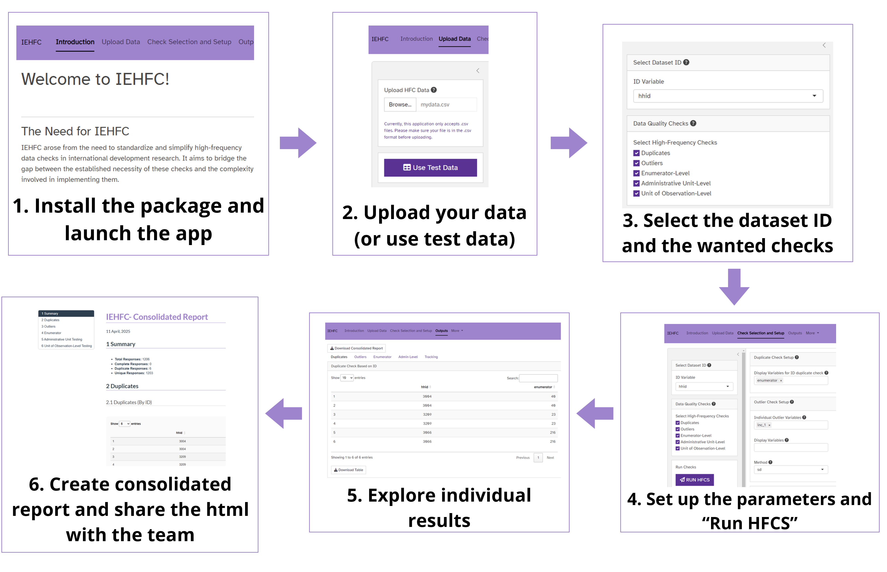
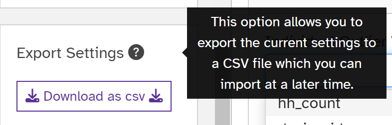
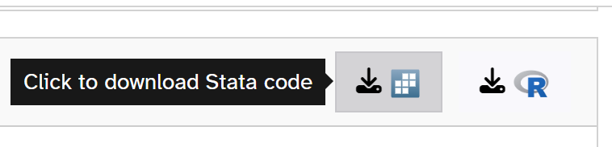
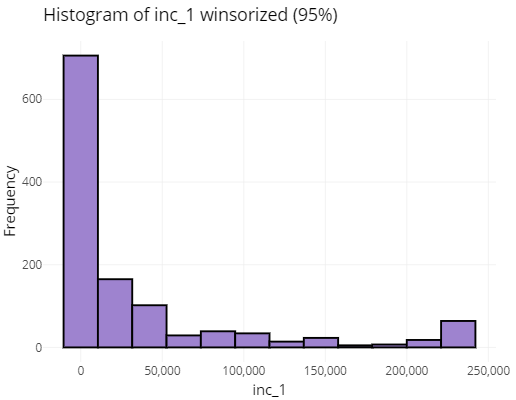
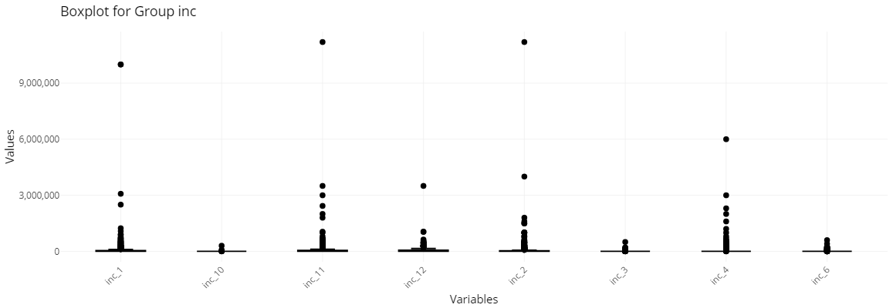
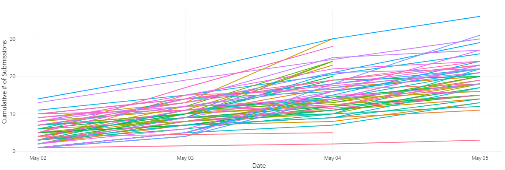

### Summary

IEHFC is a Shiny-based R package developed by DIME Analytics at the World Bank to streamline real-time data quality checks (usually known as High Frequency Checks, or HFCs) in both **primary survey data** and **secondary datasets**. The tool helps users detect common issues in data such as duplicate entries, outliers, missing data patterns, and enumerator inconsistencies—problems that often arise in data collection. By offering an intuitive interface and automated workflows, IEHFC reduces the technical burden of implementing rigorous data validation, enabling teams to identify and resolve issues earlier in the data lifecycle. The tool is open-source, accessible, and designed for use by technical and non-technical users alike, making robust data quality monitoring more feasible across research and operational teams.

---

### Statement of Need

Whether working with primary survey data or secondary datasets, researchers frequently encounter quality issues such as duplicate identifiers, missing values, inconsistent coding, and suspicious data patterns. These issues—if undetected—can undermine data integrity, which in turn affects the quality and validity of the research. Identifying problems in real time, or soon after data acquisition, dramatically improves the likelihood of diagnosing and correcting root causes such as programming errors, enumerator behavior, or integration mismatches.

Despite their importance, real-time data quality checks are often deprioritized during fieldwork or data collection, especially given the time constraints and technical effort required to build custom scripts. A [2023 needs assessment survey](https://github.com/dime-worldbank/iesurveykit/tree/main/iehfc-needs-survey) conducted by DIME Analytics found that over 90% of researchers had experience conducting or reviewing HFCs, yet most relied on manually developed workflows in R or Stata. Key pain points included:

- Lack of accessible, open-source tools;
- High setup costs for each project;
- Limited user interfaces for collaboration and reporting; and
- Inadequate customization options for diverse research contexts.

IEHFC was designed to fill these gaps. Built in R with a Shiny interface, it addresses five core needs identified in our research:

1. **Accessibility** – free, open-source, and usable without advanced coding;
2. **Functionality** – includes the full recommended set of HFCs, from duplicates to enumerator and admin unit tracking;
3. **Customizability** – users can configure variables, thresholds, and methods to fit their context;
4. **Replicability** – parameter files and code templates make it easy to repeat checks across survey rounds or datasets;
5. **Shareability** – intuitive outputs can be shared across global research teams.

IEHFC provides a unified, reusable solution for quality monitoring—empowering research and operational teams to implement systematic checks early and consistently across projects.

---

### App Overview

#### Example Usage

The first step is to install the package. Open RStudio and run the following commands:

````r
# Install devtools if you don't have it yet
install.packages("devtools")

# Install the IEHFC package from GitHub
devtools::install_github("dime-worldbank/iehfc")
````

After installing the package, users can launch the IEHFC Shiny dashboard by running:

````r
# Load the package 
library(iehfc)

# Launch the app
iehfc_app()
````

The app provides a guided process to conduct high-frequency data quality checks:

##### 1. Upload Data
- Import a `.csv` file containing your survey data.
- Preview the dataset, including variable names, types, and value ranges before applying checks.

##### 2. Select and Configure Checks
- Choose from a suite of built-in quality checks:
  - **Duplicate detection** based on ID or selected variables.
  - **Outlier identification** for individual or grouped variables using IQR or Standard Deviation.
  - **Enumerator performance analysis** including submission counts, variable averages, and cumulative submission graphs.
  - **Administrative-level submission tracking** with breakdowns by date or region.
- Customize inputs such as ID variables, grouping fields, statistical methods, and completeness flags.

##### 3. Review and Export Results
- View outputs as interactive tables and graphs.
- Download reports summarizing identified issues.
- Export reusable configuration files and template code (R or Stata) to replicate the checks programmatically.

This process can be repeated as new data becomes available, making it ideal for real-time monitoring and quality control during fieldwork. This also works for secondary data sources, such as administrative data.

---

#### IEHFC Workflow

A suggested workflow the IEHFC app is as follows:



---

#### Check Configuration Summary

| Check                                | Output                                           | Required Variables                          | Optional Variables                                                                  |
|--------------------------------------|--------------------------------------------------|----------------------------------------------|--------------------------------------------------------------------------------------|
| Duplicate                            | Duplicate Check Based on ID Table               | ID Variable                                 | Additional Display Variables                                                        |
| Duplicate                            | Duplicate Check Across Selected Variables       | Duplicate Variables                         | Additional Display Variables                                                        |
| Outlier                              | Outliers Table                                  | Individual or Grouped Outlier Variables     | Method, Multiplier, Additional Display Variables                                    |
| Outlier                              | Outlier Histograms                              | Individual Outlier Variables                | Method, Multiplier                                                                  |
| Outlier                              | Grouped Outliers Boxplots                       | Grouped Outlier Variables                   | Method, Multiplier                                                                  |
| Enumerator                           | Submissions by Enumerator Table                 | Enumerator Identifier Variable              | Submission Date Variable, Submission Complete Variable                              |
| Enumerator                           | Cumulative Submissions by Enumerator Graph      | Enumerator Identifier Variable, Date Variable |                                                                                      |
| Enumerator                           | Variables’ Average Value by Enumerator Table    | Enumerator Identifier Variable              | Average Value Variables                                                             |
| Administrative Unit                  | Submissions by Administrative Unit Table        | Admin Unit Variable                         | Nested Admin Variables, Submission Date, Submission Complete Variable                |
| Administrative Unit                  | Cumulative Submissions by Admin Unit Graph      | Admin Unit Variable, Submission Date Variable |                                                                                      |
| Unit of Observation Level (Tracking) | Unit of Observation Table                       | Unit of Observation                         | Display Variables                                                                    |

---

#### Extra Features

In addition to interactive data quality checks, IEHFC provides tools to enhance flexibility and reproducibility across data collection rounds:

#### 1. Save and Upload Parameters

After configuring your data quality checks, IEHFC allows you to download a **parameter file** (in `.csv` format) that saves all the selected options and thresholds.  
This enables users to quickly reapply the same configuration in future sessions, even after receiving new batches of data.

When returning to the app, users can select **"Upload Parameters"** to automatically populate all fields with previously saved settings, minimizing repetitive setup.



#### 2. Export Code Templates (R and Stata)

For users seeking additional flexibility and customization, IEHFC offers the option to **download code templates** in both **R** and **Stata**.  
These templates contain pre-populated scripts based on the user's configuration, allowing teams to replicate the checks programmatically in their local environments and adapt them to specific project needs.



Each of these extra features is designed to make IEHFC a practical, reusable tool across survey rounds, secondary datasets, and complex research workflows.

---

#### Example Outputs

IEHFC produces interactive tables and visualizations to support immediate interpretation and action. Below are examples of key outputs generated by the application.

Each output can be **downloaded individually** or included in a **consolidated HTML report**, making it easy to share high-frequency check results across research teams and project stakeholders.

| **Description** | **Example Output** |
|:----------------|:-------------------|
| **Outlier Detection: Individual Variable Histogram**<br>Highlights potential outliers in individual numeric variables based on user-selected thresholds (IQR or Standard Deviation). |  |
| **Outlier Detection: Grouped Variable Boxplot**<br>Summarizes distributions for sets of related variables (e.g., household income components), helping identify structural data issues across groups. |  |
| **Enumerator Monitoring: Cumulative Submissions Graph**<br>Tracks survey submissions over time for each enumerator, helping to spot unusual activity or uneven field progress. |  |

---

### Acknowledgments

We would like to thank the Development Impact (DIME) team for their support and feedback during the development of this package. 

---

### Availability and Community Guidelines

The IEHFC package and its source code are freely available on GitHub at [https://github.com/dime-worldbank/iehfc](https://github.com/dime-worldbank/iehfc) under the **MIT License**.  

We welcome community contributions, including bug reports, feature requests, and improvements.  
Users and contributors are encouraged to open issues or submit pull requests through the GitHub repository following standard open-source collaboration practices.

For more information on contributing, please refer to the contributing guidelines available in the repository.

---

### References

Jones, M., Reyes Retana, M., Fiorina, M.-A., Singh, A., & Khincha, R. (2023). Better Tools, Better Data: How to lower the costs of data quality checks. World Bank, DIME Analytics. 

Jones, M., Reyes Retana Torre, M., Fiorina, M.-A., Singh, A., & Visintini, M. (2024). High-Frequency Checks in Action: Introducing iehfc for Better Data Quality. World Bank, DIME Analytics. 

DIME Analytics. (n.d.). High-Frequency Checks. DIME Wiki, World Bank. Retrieved from https://dimewiki.worldbank.org/High_Frequency_Checks


